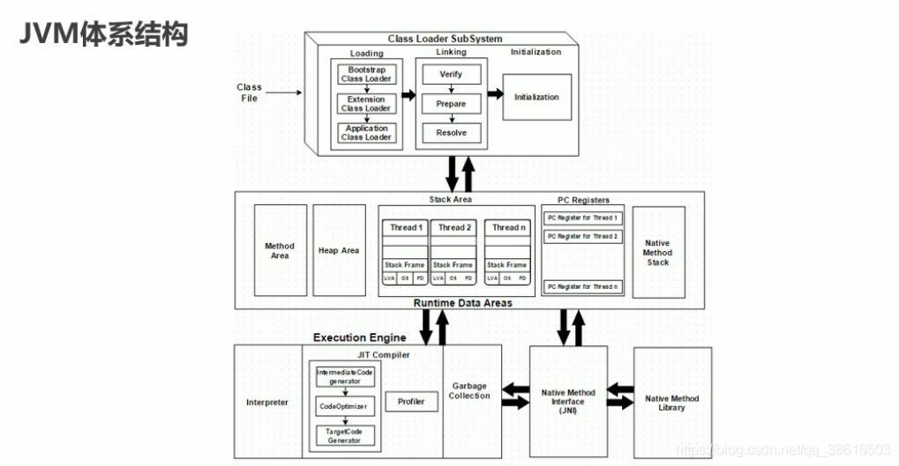
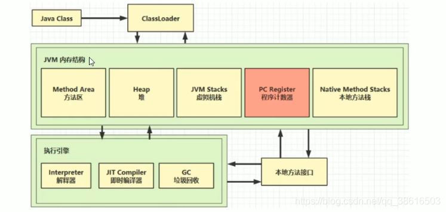
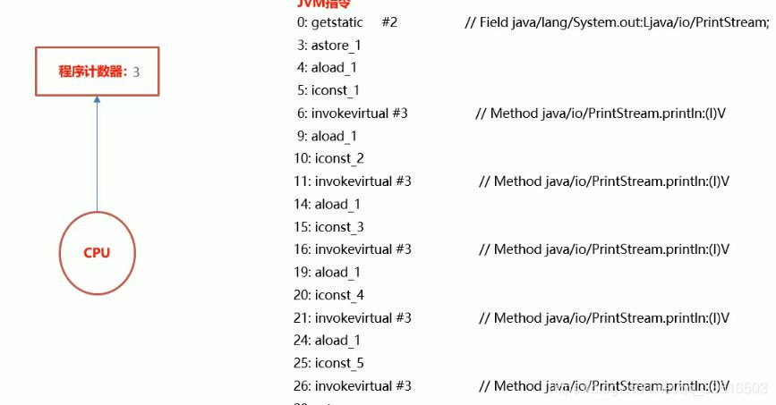
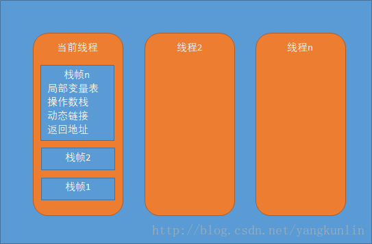
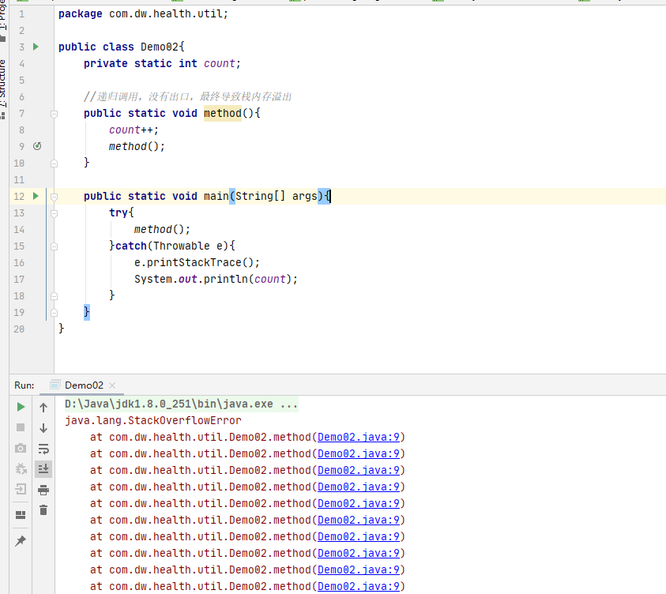
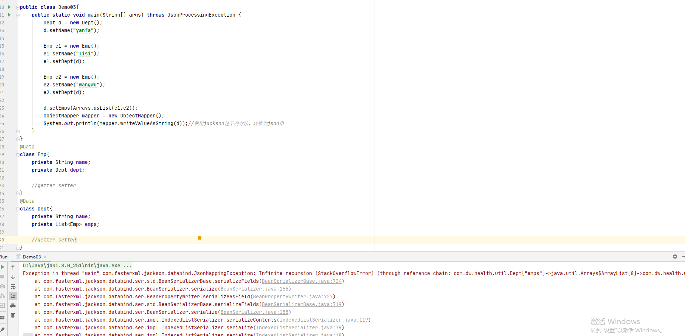
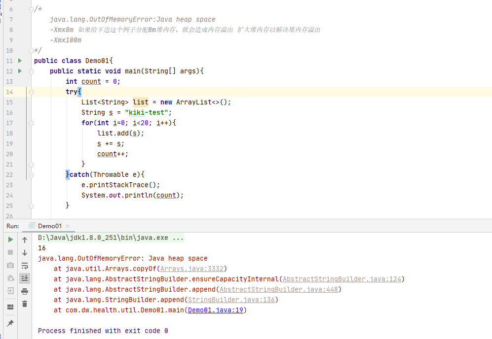
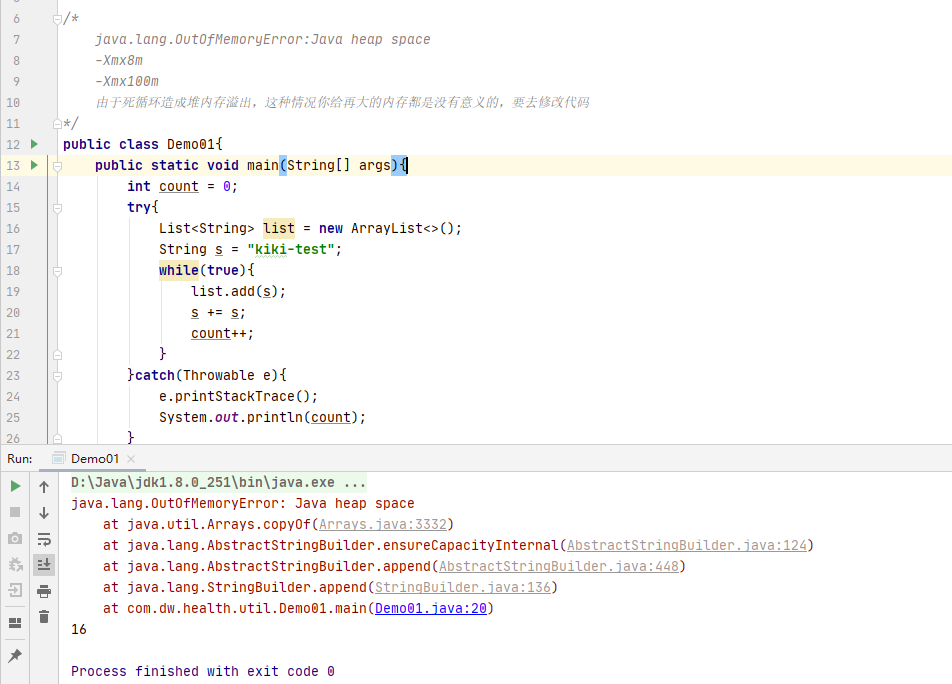
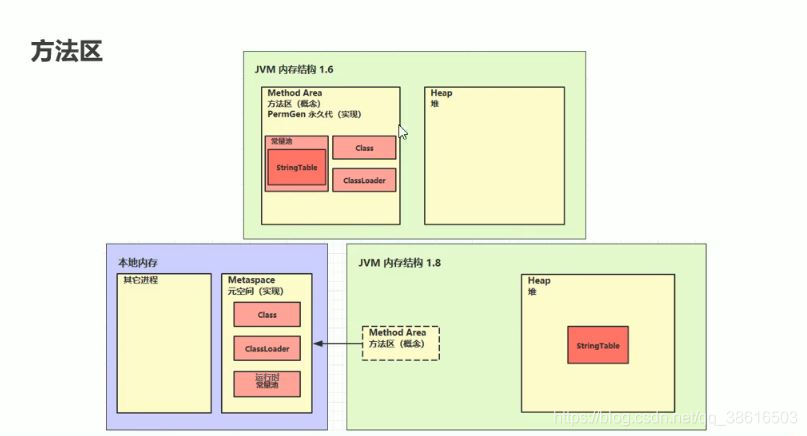

::: tip 前言
* 黑马视频笔记[匠心之作java基础强化之JVM内存结构剖析](https://www.bilibili.com/video/BV18J41187Nj)。
:::

[[toc]]
## JVM概述
### 什么是JVM

**Java Virtual Machine：Java虚拟机，用来保证Java语言跨平台。**
* Java虚拟机可以看做是一台抽象的计算机，如同真实的计算机那样，它有自己的指令集以及各种运行时内存区域
* Java虚拟机与Java语言并没有必然的联系，它只与特定的二进制文件格式(class文件格式所关联)
* Java虚拟机就是一个字节码翻译器，它将字节码文件翻译成各个系统对应的机器码，确保字节码文件能在各个系统正确运行

### 为什么要学习JVM
想必大部分小伙伴是为了面试(哈哈！！！俺也是)
举个例子：
如果我们把核心类库API称为数学公式的话，那么java虚拟机的知识就好比公式的推导过程。掌握数学公式固然可以应付考试，但是了解背后的推导过程就会更加有助于记忆和理解，并且在遇到那些没有公式的情况下，我们也能知道如何去解决问题。由此，学习java虚拟机的必要性也就不言而喻了。
::: tip 一句话总结
学习java虚拟机可以让我们更深入的理解java这门语言，以及为排查问题打下基础。
:::
*如何理解这句话呢？*

想必大家都知道，java程序上线后，会时不时出现一些问题，除去网络系统本身的问题，很多时候java程序出现问题都是由于java虚拟机的内存出现了问题。
要么是内存溢出了，要么是gc频繁导致的响应慢等等问题。

*那么如何解决这些问题呢？*

首先你必须学会看懂日志，那么就必须看懂gc日志，这便是java虚拟机的一部分
看懂了gc日志那么你就要明白什么是新生代、老年代、元空间等，这些知识便是java虚拟机的内存模型

你懂得了java虚拟机的内存模型，你就得知道java虚拟机是如何进行垃圾回收的，它们使用的垃圾回收算法是什么样的？它们有何优缺点？

要解决线上java应用程序崩溃的问题就得学会gc日志，要看懂gc日志就必须要学习java虚拟机的内存模型，要看懂java虚拟机的内存模型就要学习垃圾回收机制等等，而以上都是与java虚拟机相关的知识，所以说JVM是中高级程序员的必备技能。

### JVM体系结构


如图所示jvm体系结构分为：
Class Loader SubSystem(类加载器子系统)、Runtime Data Areas(运行时数据区)、Execution Engine(执行引擎)

#### 类加载器子系统（Class Loader SubSystem）
::: tip 
这部分可以看类加载
:::
**java的动态类加载功能由类加载器子系统来处理，它是在运行时首次引用类的时候加载连接并初始化类文件。**
* 加载(Loading)

在加载(Loading)这个地方，它是通过引导类加载器(Bootstrap Class Loader)、扩展类加载器(Extention Class Loader)、应用程序类加载器(Application Class Loader)这三个类加载器帮助完成加载。

* 连接(Linking)

加载完毕之后要做连接(Linking)操作，而在连接操作里，它又分为这三个连接步骤验证(Vertify)、准备(Prepare)、解析(Resolve)。

*验证(Vertify)*：验证做的事情是字节码验证程序将验证生成的字节码文件是否正确，如果验证失败，将收到验证错误。

*准备(Prepare)*：准备阶段是为所有静态变量分配内存，并分配默认值。

*解析(Resolve)*：解析阶段所要做的事情是用方法区的原始引用代替所有符号内存引用。

* 初始化(Initialization)

这是类加载的最后阶段，此处所有的静态变量将被分配原始值，并且将执行静态代码块。

以上便是类加载器子系统。

#### 运行时数据区(Runtime Data Areas)

* 方法区域(Method Area)

存储类级别的数据都将放在这里，每个java虚拟机只有一个方法区，所以它是一个共享的资源。

* 堆区(Heap Area)

所有的对象及其对应的实例变量和数组，都将存储在这里，而每个虚拟机堆区也只有一个。
由于方法区和堆区是由多个线程共享的，所以它们不是线程安全的。

* 虚拟机栈(Stack Area)

对于每个线程创建一个单独的运行时栈，而对于每个方法调用我们在栈内存会创建一个条目，是为栈帧(Stack Frame)，所有的局部变量都是在栈内存创建，由于它不是共享的资源，所以它是线程安全的。

* pc寄存器(PC Registers)

每个线程都有它自己的pc寄存器，所以它也是线程安全的，它的作用是用来保存当前正在执行的指令，一旦指令执行，pc寄存器将会更新到下一条指令。

* 本地方法栈(Native Method Stack)

主要是用来保存本机的方法信息，而对于每个线程，它将单独创建本地方法栈，所以它也是线程安全的。

#### 执行引擎(Execution Engine)

* 解释器(Interpreter)

主要作用是读取字节码，对其进行解释并逐一执行，解释器解释字节码的速度较快，但它的执行速度较慢。   
致命缺点：
当一个方法被多次调用，它每次都需要解释，所以这个时候就出现了JIT编译器(JIT Compiler)。

* JIT编译器(JIT Compiler)

被称为即时编译器，它的作用就是用来解决解释器的缺点的，当它发现重复代码时，它将采用即时编译器，进行编译整个字节码并将其更改为本地代码，使本地代码直接用于重复的方法调用，从而提高系统性能。
JIT Compiler从右向左，从上至下，依次是中间代码生成器(用来生成中间代码)、代码优化器(负责优化上面生成的中间代码)、目标代码生成器(主要用来负责生成机器码)；最后分析器(Profiler):它是个特殊的组件，负责查找热点，也就是来看这个方法是否被多次调用。

* 垃圾回收器(Garbage Collection)

它也是执行引擎的一部分，它收集或删除未引用的对象，我们可以通过调用System.gc来触发垃圾回收，但是我们不能保证执行，java的垃圾收集器它只收集你用关键字创建的对象，因此那些你不是通过new的形式创建的对象，就可以直接使用finalize方法来直接清理操作。

#### 本地方法接口(Native Method Interface,JNI)

本地方法接口将与本地方法库(Native Method Library)进行交互，并提供这个执行引擎所需要的本地库。

#### 本地方法库(Native Method Library)

它是执行引擎所需要的本机库的集合

## JVM内存结构

### JVM内存结构



#### 程序计数器

**概念** 

冯诺依曼计算机体系结构的主要内容之一就是程序预存储，计算机自动执行。处理器要执行的程序都是以二进制代码块的方式存储在计算机的存储器中，处理器将这些代码逐条的取到处理器中，再编译执行，以完成整个程序的执行。为了保证程序能够连续的执行下去，CPU必须具有某些手段来确定下一条取址指令的地址，程序计数器正是起到这种作用，因此又被称为指令计数器。

**作用**

保存当前执行指令的地址，一旦指令执行，程序计数器将更新到下一条指令

写个测试类Demo01.java使用命令javap -v Demo01.class 进行反编译


**程序计数器保证了我们的程序正常的往下执行**

#### 虚拟机栈

**概述**

每一个程序在执行的时候是一个进程，而进程中最小的执行单元是一个线程，那么这个线程在执行的时候是不是该有一个内存空间呢，这个内存空间就是我们所说的虚拟机栈，每个线程都有一个对应的虚拟机栈，所以它是线程私有的。而我们程序的执行它是通过调用方法来实现的，而每个方法定义了一个栈帧，也就是说我们的虚拟机栈里边会有一个或者多个栈帧，而每个栈帧又包括局部变量表、操作数栈、动态链接、方法返回值等信息。

**虚拟机栈**

每个线程运行时所需要的内存空间，称为虚拟机栈；每个栈由多个栈帧(Frame)组成，对应着每次方法调用时所占用的内存；每个线程只有一个活动栈帧，对应着当前正在执行的那个方法。

#### 栈帧



**局部变量表**: 存放局部变量的列表。  
一个局部变量可以保存类型为boolean、byte、char、short、float、reference和returnAddress的数据。  
两个局部变量可以保存一个类型为long和double的数据。  
局部变量使用索引来进行定位访问，第一个局部变量的索引值为零。

**操作数栈**:也称为操作栈，它是一个后进先出的栈。  
当一个方法刚刚开始执行时，其操作数栈是空的  
随着方法执行和字节码的执行，会从局部变量表或对象实例的字段中复制常量或变量写入到操作栈，再随着计算的进行将栈中元素出栈到局部变量表或者返回给方法调用者，也就是出栈/入栈操作  
一个完整的方法执行期间往往包含多个这样出栈/入栈的过程  
简单理解，操作数栈是线程实际的操作台 

**动态链接**：简单的理解为指向运行时常量池的引用  
在class文件里面，描述了一个方法调用其它方法，或者访问其成员变量是通过符号引用来表示的，动态链接的作用就是将这些符号引用所表示的方法转换为实际方法的直接引用

**方法返回地址**：方法调用的返回，包括正常返回(有返回值)和异常返回(没有返回值),不同的返回值类型有不同的指令  
无论方法采用何种方式退出，在方法退出后都需要返回到方法被调用的位置，程序才能继续执行，方法返回时可能需要在当前栈帧中保存了一些信息，用来帮他恢复它的上层方法执行状态

#### 栈内存溢出

1.栈帧过多导致栈内存溢出  
2.栈帧过大导致栈内存溢出  

测试代码1:栈帧过多导致栈内存溢出
``` java
/*
	java.lang.StackOverflowError
	-Xss256k:次数减少
	-Xss10m:次数变多
*/
public class Demo02{
	private static int count;
	
	//递归调用，没有出口，最终导致栈内存溢出
	public static void method(){
		count++;
		method();
	}

	public static void main(String[] args){
		try{
			method();
		}catch(Throwable e){
			e.printStackTrace();
			System.out.println(count);
		}
	}
}
```
::: details 验证

:::
测试代码2：栈帧过大导致栈内存溢出
```java
public class Demo03{
	public static void main(String[] args) throws JsonProcessingException{
		Dept d = new Dept();
		d.setName("yanfa");

		Emp e1 = new Emp();
		e1.setName("lisi");
		e1.setDept(d);

		Emp e2 = new Emp();
		e2.setName("wangwu");
		e2.setDept(d);

		d.setEmps(Arrays.asList(e1,e2));

		ObjectMapper mapper = new ObjectMapper();
		System.out.println(mapper.writeValueAsString(d));//使用jackson包下的方法，转换为json串
	}
}
@data
class Emp{
	private String name;
	private Dept dept;

	//getter setter
}
@data
class Dept{
	private String name;
	private List<Emp> emps;

	//getter setter
}
```
::: details 验证

:::

#### 本地方法栈

被native修饰的方法就是本地方法  
本地方法栈的功能特点类似于虚拟机栈，也是线程私有的  
不同的是：  
本地方法栈服务的对象是JVM执行的native方法，而虚拟机栈服务的是JVM执行的Java方法  
如何去服务native方法？  
native方法使用什么语言实现？  
怎么组织像栈帧这种为了服务方法的数据结构？  
虚拟机规范并未给出强制规定，因此不同的虚拟机是可以进行自由实现  

#### 堆Heap

**作用**:堆是用来存放对象的内存区域  
**特点**:  
堆是被所有线程共享的一块内存区域，在虚拟机启动时创建  
堆的区域是用来存放对象实例的，因此也是垃圾收集器管理的主要区域  
堆在逻辑上划分为新生代和老年代，新生代分为Eden区、ServivorFrom、ServivorTo 三个区  
堆一般实现成大小可以扩展的，使用"-Xms"与"-Xmx"控制堆的最小与最大内存

**堆内存溢出**

如果我们不断的产生新对象，而产生的对象又在一直被使用，也就意味着这些对象就不能被垃圾回收，这些对象就有可能导致，内存被耗尽，也就是我们所说的内存溢出。  
演示堆内存溢出：堆内存大小不够而造成的堆内存溢出
``` java
/*
	java.lang.OutOfMemoryError:Java heap space
	-Xmx8m 如果给下边这个例子分配8m堆内存，就会造成内存溢出 扩大堆内存以解决堆内存溢出
	-Xmx100m
*/
public class Demo01{
	public static void main(String[] args){
		int count = 0;
		try{
			List<String> list = new ArrayList<>();
			String s = "kiki-test";
			for(int i=0; i<20; i++){
				list.add(s);
				s += s;
				count++;
			}
		}catch(Throwable e){
			e.printStackTrace();
			System.out.println(count);
		}
		
	}
}
```
::: details 验证

:::

演示堆内存溢出：由于业务问题引起的堆内存溢出
```java
/*
	java.lang.OutOfMemoryError:Java heap space
	-Xmx8m
	-Xmx100m
	由于死循环造成堆内存溢出，这种情况你给再大的内存都是没有意义的，要去修改代码
*/
public class Demo01{
	public static void main(String[] args){
		int count = 0;
		try{
			List<String> list = new ArrayList<>();
			String s = "kiki-test";
			while(true){
				list.add(s);
				s += s;
				count++;
			}
		}catch(Throwable e){
			e.printStackTrace();
			System.out.println(count);
		}

	}
}
```

::: details 验证

:::  

堆内存溢出：  
错误提示：java.lang.OutOfMemoryError:Java heap space  
错误原因：  
1.内存真的不够，通过调整堆内存大小解决  
2.存在死循环，通过修改代码来解决

**堆内存诊断**
1.jps:查看当前系统中有哪些Java进程，查看进程id  
2.jmap工具：查看堆内存占用情况(某一时刻)  
jmap -heap 进程id  
3.jconsole工具：图形界面的，内置Java性能分析器，多功能的检测工具，可以连续监测

#### 方法区

**作用**:存储每个类的结构,例如运行时常量池，字段和方法数据，以及方法和构造函数的代码，包括用于类和实例初始化以及接口初始化的特殊方法等。

**不同版本jdk的方法区**


jdk8，元空间默认使用的是系统内存  
演示元空间内存溢出   
java.lang.OutOfMemoryError:Metaspace
-XX:MaxMetaspaceSize = 8m  
设置大小，警用指针压缩  
-XX:MaxMetaspaceSize =10m -XX:-UseCompressedOops


