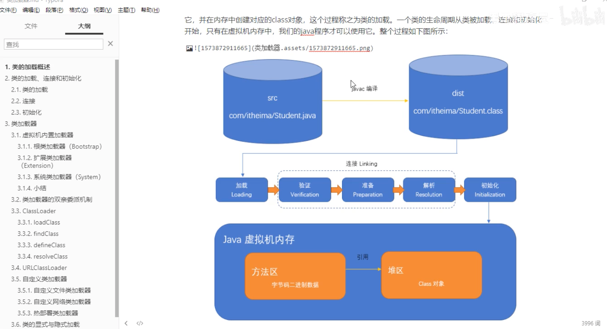
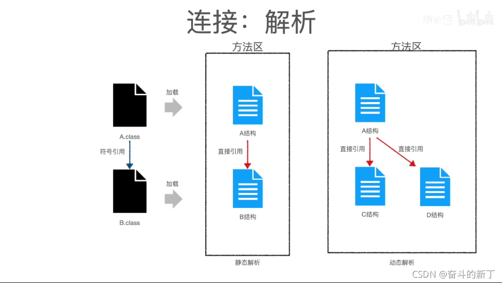
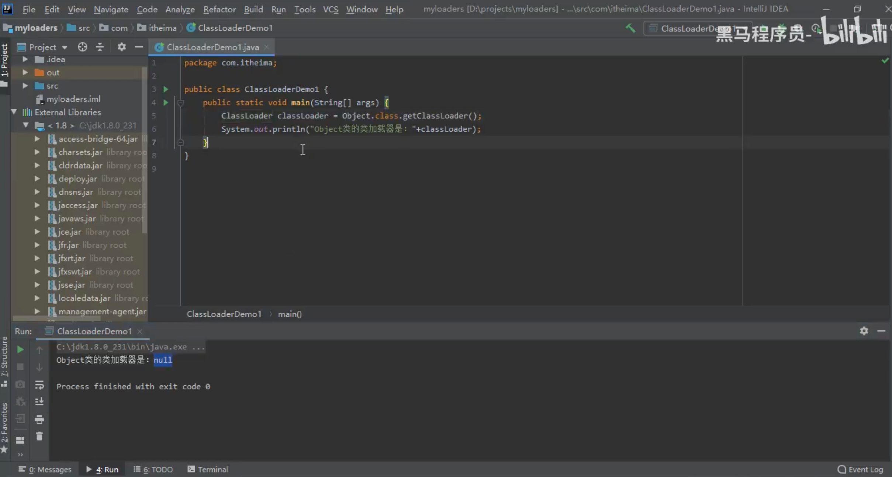
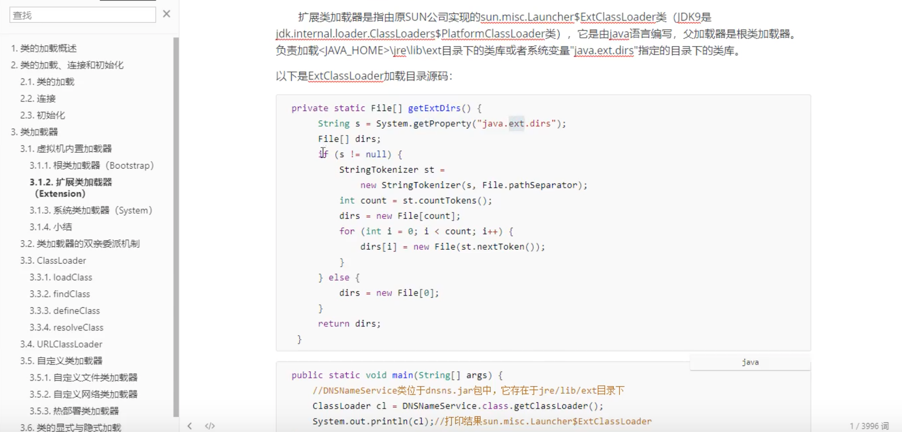
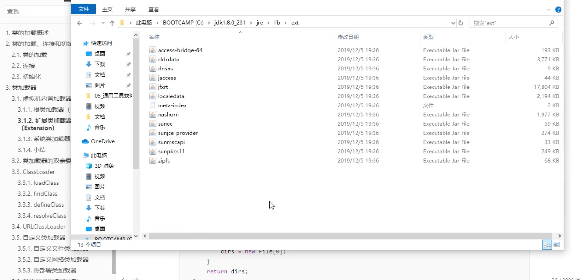
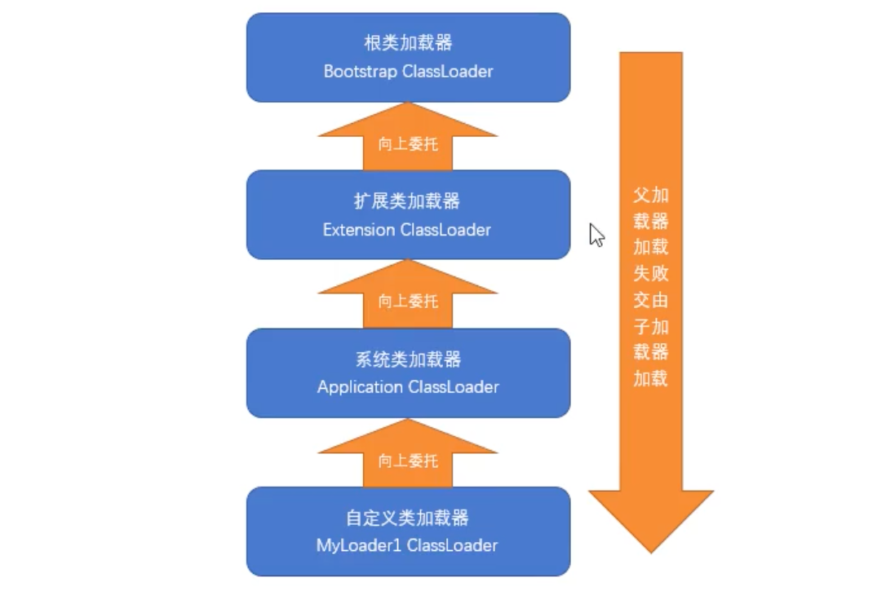
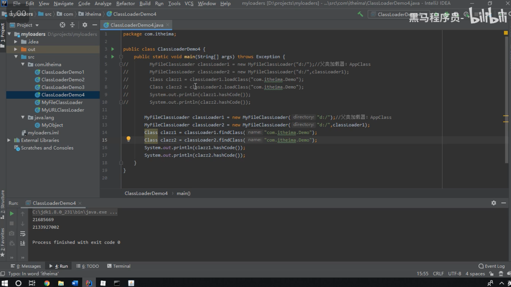
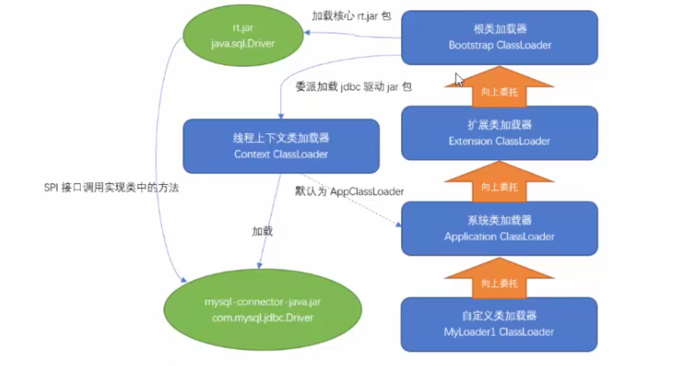
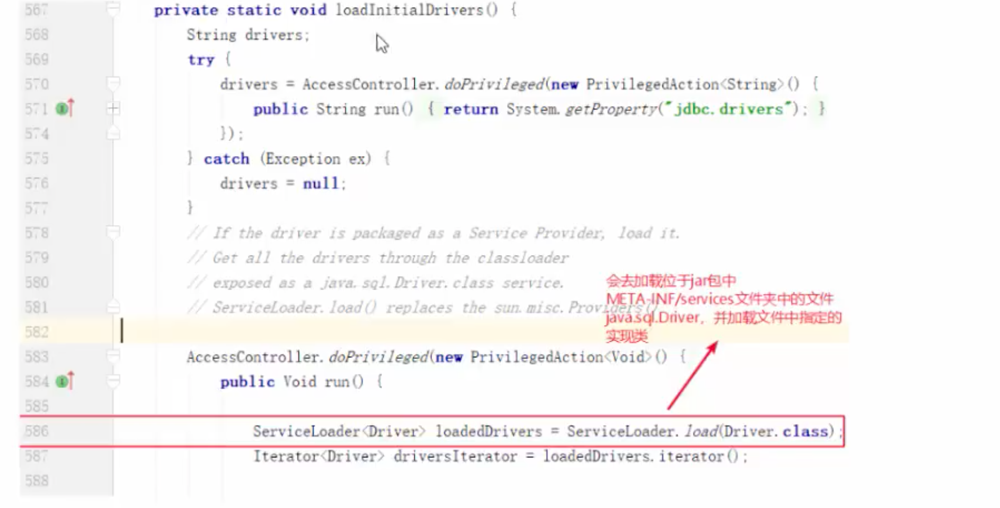
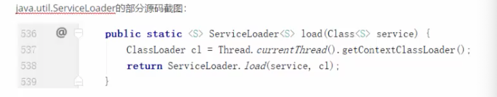

::: tip 前言
* 黑马视频笔记[系统学习让你轻松定义java类加载器](https://www.bilibili.com/video/BV1vJ41177cw)。
:::

[[toc]]

## 简介
类加载就是将磁盘上的class文件加载到内存中。本课程详细分析了从编写一个类到编译、加载的整个过程。从讲解java虚拟机内置的三个类加载器开始，分别介绍了他们的作用，并重点讲解了类加载器的双亲委派机制。 针对JDK中提供的ClassLoader和URLClassLoader中的主要方法进行了细致的分析，明确了双亲委派模式的实现代码。另外使用案例对URLClassLoader的使用进行了详细说明。

## 内容介绍
### 1.类加载器简介

java文件 -> javac编译器（JIT编译器参与） -> 字节码文件 -> 类加载

加载 ：

连接：

初始化：

Java 虚拟机内存
* 方法区（字节码二进制数据）
* 堆区（Class对象）

### 2.类的加载连接和初始化
当 Java程序中需要使用到某个类时，虚拟机会保证这个类已经被加载、连接和初始化。而连接又包含验证、准备和解析这三个子过程，这个过程必须严格按照顺序执行。
#### 2.1 类的加载
通过类的完全限定名（包名和类名）查找此类的字节码文件，把类的.class文件中的二进制数据读入到内存中，并存放在运行时数据区的方法区内，然后利用字节码文件创建一个Class对象，用来封住类在方法区内的数据结构并存放在堆区内。这个过程是由类加载器完成的，我们后面会进行详细讲解。

#### 2.2 连接
* **验证**：确保被加载类的正确性。class 文件的字节流中包含的信息符合当前虚拟机要求，不会危害虚拟机自身的安全。
* **准备**：为类的静态变量分配内存，并将其设置为默认值。此阶段仅仅只为静态类变量（即 static 修饰的字段变量）分配内存，并且设置该变量的初始值。（比如 static int num = 5，这里只将 num 初始化为0，5的值将会在初始化时赋值）。对于 final static 修饰的变量，编译的时候就会分配了，也不会分配实例变量的内存。
* **解析**：把类中的符号引用转换为直接引用。符号引用就是一组符号来描述目标，而直接引用就是直接指向目标的指针。相对偏移量或一个间接定位到目标的句柄。（可参考"虚拟机指令"相关内容）
::: details 类加载连接的解析步骤中符号引用替换为直接引用是什么意思

首先看图，当一个Java类被编译成Class之后，假如这个类称为A，并且A中引用了B，那么在编译阶段A是不知道B有没有被编译的，而且此时B也一定没有被加载，所以A 肯定不知道B的实际地址，那么此时在A的class文件中，将使用一个字符串S来代表B的地址，S就被称为符号引用，在运行时，如果A发生了类加载到了解析阶段会发现B还未被加载，那么将会触发B的类加载，将B加载到虚拟机中，此时A中B的符号引用将会被替换为B的实际地址，这被称为直接引用。这样也能真正的调用B了。   

但是事情没有这么简单，了解多态的同学应该知道Java通过后期绑定的方式来实现多态，那么后期绑定这个概念又是如何实现的呢，其实就是这里的动态解析。接着上面所说，如果A调用的B是一个具体的实现类那么就称为静态解析，因为解析的目标类型很明确，而假如上层Java代码使用了多态，这里B是一个抽象类或者是接口，那么B可能有两个具体的实现类C和D，此时B的具体实现并不明确，当然也就不知道使用那个具体类的直接引用来进行替换，既然不知道那就等一等吧，直到在运行过程中发生了调用，此时虚拟机调用栈中将会得到具体的类信息，这时候再进行解析，就能用明确的直接引用，来替换符号引用，这也就解释了为什么解析阶段有时候会发生在初始化阶段之后，这就是动态解析，用它来实现后期绑定。
:::
#### 2.3 初始化
类加载最后阶段，若该类具有父类，则先对父类进行初始化，执行静态变量赋值和静态代码块代码，成员变量也将被初始化。
### 3. 类加载器
类的加载是由类加载器完成的。类加载器可以分为两种：第一种是Java虚拟机自带的类加载器，分别为启动类加载器、扩展类加载器和系统类加载器。第二种是用户自定义的类加载器，是java.lang.ClassLoader的子类实例。
#### 3.1 虚拟机内置加载器
##### 3.1.1 根类加载器（Bootstrap）
根类加载器是最底层的类加载器，是虚拟机的一部分，它是由C++语言实现的，且没有父加载器，也没有继承 java.lang.ClassLoader 类。它主要负责加载由系统属性 "sun.boot.class.path" 指定的路径下的核心类库（即<JAVA_HOME>\jre\lib），出于安全考虑，根类加载器只加载 java、javax、sun开头的类。
``` java
public static void main(String[] args) {
	ClassLoader c1 = Object.class.getClassLoader();
    System.out.println(c1); // 根类加载器打印出来的结果是 null
}
```



##### 3.1.2 扩展类加载器（Extension）
扩展类加载器是指由原SUN公司实现的 sun.misc.Launcher$ExtClassLoader类（JDK9是 jdk.internal.loader.ClassLoaders$PlatformClassLoader类），它是由java语言编写，父加载器是根类加载器。负责加载<JAVA_HOME>\jre\lib\ext目录下的类库或者系统变量"java.ext.dirs"指定目录下的类库。

以下是ExtClassLoader 加载目录源码：



##### 3.1.3 系统类加载器（System）
系统类加载器也称之为应用类加载器，也是纯java类，是原SUN公司实现的 sun.misc.Launcher$AppClassLoader 类（JDK9是 jdk.internal.loader.ClassLoaders$AppClassLoader）。它的父加载器是扩展类加载器。它负责从classpath环境变量或者系统属性java.class.path所指定的目录中加载类，它是用户自定义的类加载器的默认父加载器。一般情况下，该类加载器是程序中默认的类加载器，可以通过ClassLoader.getSystemClassLoader() 直接获得。
``` java 
public class ClassLoaderDemo {
	public static void main(String[] args) {
    	// 自己编写的类使用的类加载器
        ClassLoader classLoader = ClasLoaderDemo.class.getClassLoader();
        System.out.println(classLoader);// sun.misc.Launcher$AppClassLoader
    }
}
```
#### 3.1.4 小结
在程序开发中，类的加载几乎是由上述3种类加载器相互配合执行的，同时我们还可以自定义类加载器，需要朱注意的是，java虚拟机对class文件采用的是按需加载的方式，也就是说当需要使用该类时才会将它的class文件加载到内存中生成class对象，而且加载某个类的class文件时，Java虚拟机采用的是双亲委派模式，即把加载类的请求交由父加载器处理，它是一种任务委派模式。

### 3.2 类加载的双亲委派机制
除了根类加载器之外，其他的类加载器都需要有自己的父加载器，从JDK1.2开始，类的加载过程采用双亲委派机制，这种机制能够很好的保护java程序的安全，除了虚拟机自带的根类加载器之外，其余的类加载器都有唯一的父加载器。比如，如果需要calssLoader加载一个类时，该classLoader先委托自己的父加载器先去加载这个类，若父加载器能够加载，则由父加载器加载，否则才用classLoader自己加载的这个类。即每个类加载器都很懒，加载类时都先让父加载器去尝试加载，一直到根类加载器，加载不到时自己才去加载。真正加载类的加载器我们叫做启动类加载器。注意，双亲委派机制的父子关系并非面向对象程序设计中的继承关系，而是通过使用组合模式来复父加载器代码，这种机制如下图所示：

``` java 
 
public class ClassLoaderDemo1 {
 
    public static void main(String[] args) {
        ClassLoader classLoader = Object.class.getClassLoader();
        System.out.println("Object类的类加载器是：" + classLoader);
        System.out.println("---------------");
        ClassLoader classLoader1 = DNSNameService.class.getClassLoader();
        System.out.println("DNSNameService类的类加载器：" + classLoader1);
        System.out.println("----------------");
        ClassLoader classLoader2 = ClassLoaderDemo1.class.getClassLoader();
        System.out.println("ClassLoaderDemo1的类加载器是：" + classLoader2);
 
        while (classLoader2 != null){
            System.out.println(classLoader2);
            classLoader2 = classLoader2.getParent(); // 获取父类加载器
        }
    }
 
}
```
使用双亲委派机制的好处：
* 可以避免类的重复加载，当父类加载器已经加载了该类时，就没有必要子 ClassLoader 再加载一次。   
* 考虑到安全因素，java核心 api 中定义类型不会被随意替换，假设通过网络传递一个名为java.lang.Object的类，通过双亲委托模式传递到启动类加载器，而启动类加载器在核心Java API发现这个名字的类，发现该类已被加载，并不会重新加载网络传递过来的java.lang.Object，而直接返回已加载过的Object.class，这样便可以防止核心API库被随意篡改。
因为java.lang包属于核心包，只能由根类加载器进行加载，而根据类加载的双亲委派机制，根类加载不到这个MyObject类的（自定义的），所以只能由AppClassLoader进行加载，而这又是不允许的，所以会报出"Prohilbited package name:java.lang"（禁止的包名）错误。

### 3.3 ClassLoader
所有的类加载器（除了根类加载器）都必须继承java.lang.ClassLoader。它是一个抽象类，主要方法如下：

#### 3.3.1 loadClass
在 ClassLoader 的源码中，有一个方法loadClass(String name, boolean resolve) ，这里就是双亲委托模式的代码实现。从源码中我们可以观察到它的执行顺序。需要注意的是，只有父类加载器加载不到类时，会调用 findClass 方法进行类的查找，所有，在定义自己的类加载器时，不要覆盖掉该方法，而应该覆盖掉 findClass 方法。
``` java 
// ClassLoader 类的 loadClass 源码 
protected Class<?> loadClass(String name, boolean resolve)
        throws ClassNotFoundException
    {
        synchronized (getClassLoadingLock(name)) {
            // First, check if the class has already been loaded
            Class<?> c = findLoadedClass(name);
            if (c == null) {
                long t0 = System.nanoTime();
                try {
                    if (parent != null) {
                        c = parent.loadClass(name, false);
                    } else {
                        c = findBootstrapClassOrNull(name);
                    }
                } catch (ClassNotFoundException e) {
                    // ClassNotFoundException thrown if class not found
                    // from the non-null parent class loader
                }
 
                if (c == null) {
                    // If still not found, then invoke findClass in order
                    // to find the class.
                    long t1 = System.nanoTime();
                    c = findClass(name);
 
                    // this is the defining class loader; record the stats
                    sun.misc.PerfCounter.getParentDelegationTime().addTime(t1 - t0);
                    sun.misc.PerfCounter.getFindClassTime().addElapsedTimeFrom(t1);
                    sun.misc.PerfCounter.getFindClasses().increment();
                }
            }
            if (resolve) {
                resolveClass(c);
            }
            return c;
        }
    }
```
使用指定的二进制名称来加载类。此方法的默认实现将按以下顺序搜索类：
* 调用 findLoadedClass(String) 来检查是否已经加载类。
* 在父类加载器上调用 loadClass 方法，如果父类加载器为null，则使用虚拟机的内置类加载器。
* 调用 findClass(String) 方法查找类。
如果使用上述步骤找到类，并且 reslove 标志为真，则此方法在得到的 Class 对象上调用 resolveClass(Class) 方法。
#### 3.3.2 findClass
在自定义类加载器时，一般我们需要覆盖这个方法，且ClassLoader 中给出了一个默认的错误实现。
``` java 
   protected Class<?> findClass(String name) throws ClassNotFoundException {
        throw new ClassNotFoundException(name);
   }
```
#### 3.3.3 defineClass
该方法的签名如下。用来将 byte 字节解析成虚拟机能够识别的Class对象。defineClass() 方法通常与findClass()方法一起使用。在自定义类加载器时，会直接覆盖ClassLoader的findClass() 方法获取要加载类的字节码，然后调用defineClass() 方法生成Class对象。
``` java 
    protected final Class<?> defineClass(byte[] b, int off, int len)
        throws ClassFormatError
    {
        return defineClass(null, b, off, len, null);
    }
```
#### 3.3.4 resolveClass
连接指定的类。类加载器可以使用此方法来连接类。
### 3.4 UELClassLoader
在 java.net 包中，JDK提供了一个更加易用的类加载器URLClassLoader，它扩展了 ClassLoader，能够从本地或者网络上指定的位置加载类，我们可以使用该类作为自定义的类加载器使用。  
构造方法：   
public URLClassLoader(URL[] urls)：指定要加载的类所在的URL地址，父类加载器默认为系统类加载器  
public URLClassLoader(URL[] urls, ClassLoader parent)：指定要加载的类所在的URL地址，并指定父类加载器。  
**案件1：加载磁盘上的类**
``` java 
public class ClassLoaderDemo2 {
 
    public static void main(String[] args) throws Exception {
        File file = new File("d:/");
        URI uri = file.toURI();
        URL url = uri.toURL();
 
        URLClassLoader classLoader = new URLClassLoader(new URL[]{url});
        System.out.println("父类加载器：" + classLoader.getParent()); // 默认父类加载器是系统类加载器
        Class clazz = classLoader.loadClass("com.itheima.Demo");
        clazz.newInstance();
    }
 
}
```
**案例2：加载网络上的类**
``` java
public class ClassLoaderDemo3 {
 
    public static void main(String[] args) throws Exception {
        URL url = new URL("http://localhost:8080/examples/");
        URLClassLoader classLoader = new URLClassLoader(new URL[]{url});
        System.out.println("父类加载器：" + classLoader.getParent()); // 默认父类加载器是系统类加载器
        Class clazz = classLoader.loadClass("com.itheima.Demo");
        clazz.newInstance();
    }
 
}
```
### 3.5 自定义类加载器
我们如果需要自定义类加载器，只需要继承ClassLoader，并覆盖掉findClass方法即可。
#### 3.5.1 自定义文件类加载器
``` java 
// 1. 继承ClassLoader
// 2. 覆盖 findClass方法
public class MyFileClassLoader extends ClassLoader {
 
    private String directory; // 被加载类所在的目录
 
    public MyFileClassLoader(String directory) { // 默认父类加载器就是系统类加载器 AppClassLoader
        this.directory = directory;
    }
 
    public MyFileClassLoader(ClassLoader parent, String directory) {
        super(parent);
        this.directory = directory;
    }
 
    // com.itheima.Demo
    @Override
    protected Class<?> findClass(String name) throws ClassNotFoundException {
        try {
            // 把类名转换为目录
            String file = directory + File.separator + name.replace(".", File.separator) + ".class"; // D:/com/itheima/Demo.class
            // 构建输入流
            InputStream in = new FileInputStream(file);
            // 构建字节输出流
            ByteArrayOutputStream baos = new ByteArrayOutputStream();
            byte[] buf = new byte[1024];
            int len = -1;
            while ((len = in.read(buf)) != -1) {
                baos.write(buf, 0, len);
            }
            byte[] data = baos.toByteArray(); // 读取到的字节码的二进制数据
            in.close();
            baos.close();
            return defineClass(name, data, 0, data.length);
        } catch (IOException e) {
            throw new RuntimeException(e);
        }
    }
 
    public static void main(String[] args) throws Exception {
        MyFileClassLoader classLoader = new MyFileClassLoader("d:/");
        Class<?> clazz = classLoader.loadClass("com.itheima.Demo");
        clazz.newInstance();
    }
 
}
```
#### 3.5.2 自定义网络类加载器
``` java 
// 1. 继承ClassLoader
// 2. 覆盖 findClass方法
public class MyURLClassLoader extends ClassLoader {
 
    private String url;
 
    public MyURLClassLoader(String url) { // 默认父类加载器就是系统类加载器 AppClassLoader
        this.url = url;
    }
 
    public MyURLClassLoader(ClassLoader parent, String url) {
        super(parent);
        this.url = url;
    }
 
    // com.itheima.Demo
    @Override
    protected Class<?> findClass(String name) throws ClassNotFoundException {
        try {
            // 把类名转换为目录
            String path = url + "/" + name.replace(".", "/") + ".class"; // D:/com/itheima/Demo.class
            URL url = new URL(path);
            // 构建输入流
            InputStream in = url.openStream();
            // 构建字节输出流
            ByteArrayOutputStream baos = new ByteArrayOutputStream();
            byte[] buf = new byte[1024];
            int len = -1;
            while ((len = in.read(buf)) != -1) {
                baos.write(buf, 0, len);
            }
            byte[] data = baos.toByteArray(); // 读取到的字节码的二进制数据
            in.close();
            baos.close();
            return defineClass(name, data, 0, data.length);
        } catch (IOException e) {
            throw new RuntimeException(e);
        }
    }
 
    public static void main(String[] args) throws Exception {
        MyURLClassLoader classLoader = new MyURLClassLoader("http://localhost:8080/example");
        Class<?> clazz = classLoader.loadClass("com.itheima.Demo");
        clazz.newInstance();
    }
 
}
```
#### 3.5.3 热部署类加载器
当我们调用 loadClass 方法加载类时，会采用双亲委派模式，即如果类已经被加载，就从缓存中获取，不会重新加载。如果同一个 class 被同一个类加载器多次加载，则会报错。因此，我们要实现热部署让同一个class文件被不同的类加载器重复加载即可。但是不能调用 loadClass 方法，而应该调用 findClass 方法，避开双亲委托模式，从而实现同一个类被多次加载，实现热部署。
``` java 
MyFileClassLoader classLoader1 = new MyFileClassLoader("d:/"); // 父类加载器：APPClassLoader
MyFileClassLoader classLoader2 = new MyFileClassLoader("d:/", classLoader1);
Class class1 = classLoader1.loadClass("com.itheima.Demo");
Class class2 = classLoader2.loadClass("com.itheima.Demo");
System.out.println(class1.hashCode());
System.out.println(class2.hashCode());
结果：class1和class2的hashCode一致
 
MyFileClassLoader classLoader1 = new MyFileClassLoader("d:/"); // 父类加载器：APPClassLoader
MyFileClassLoader classLoader2 = new MyFileClassLoader("d:/", classLoader1);
Class class1 = classLoader1.findClass("com.itheima.Demo");
Class class2 = classLoader2.findClass("com.itheima.Demo");
System.out.println(class1.hashCode());
System.out.println(class2.hashCode());
结果：class1和class2的hashCode不一致
```

### 3.6 类的显式与隐式加载
类的加载方式是指虚拟机将class文件加载到内存的方式。  
显示加载是指在 java 代码通过调用 ClassLoader 加载 class 对象，比如 Class.forName(String name); this.getClass().getClassLoader().loadClass()加载类。  
隐式加载指不需要在 java 代码中明确调用加载的代码，而是通过虚拟机自动加载到内存中。比如在加载某个class 时，该class引用了另外一个类的对象，那么这个对象的字节码文件就会被虚拟机自动加载到内存中。
### 3.7 线程上下文类加载器
在 java 中存在着很多的服务提供者接口 SPI，全称 Service Provider Interface，是Java 提供的一套用来被第三方实现或者扩展的API，这些接口一般由第三方提供实现，常用 SPI 有 JDBC、JNDI等。这些 SPI 的接口（比如JDBC中的java.sql.Driver）属于核心类库，一般存在rt.jat包中，由根类加载器加载。而第三方实现的代码一般作为依赖jar包存放在classpath路径下，由于SPI接口中的代码需要加载具体的第三方实现类并调用其相关方法，SPI的接口类是由根类加载器加载的，Bootstrap 类加载器无法直接加载位于classpath下的具体实现类。由于双亲委派模式的存在，Bootstrap类加载器也无法反向委托AppClassLoaser加载SPI的具体实现类。在这种情况下，java提供了上下文类加载器用于解决以上问题。  

线程上下文类加载器可以通过 java.lang.Thread 的 getContextClassLoader() 来获取，或者通过 setContextClassLoader(ClassLoader cl)来设置线程的上下文类加载器。如果没有手动设置上下文类加载器，线程将继承其父线程的上下文类加载器，初始线程的上下文类加载器是系统类加载器（AppClassLoader），在线程运行的代码可以通过此类加载器来加载类或资源。  

显现这种加载类的方式破坏了双亲委托模型，但它使得 java 类加载器变得更加灵活。  

我们以 JDBC 的类为例做一下说明。在 JDBC中有一个类 java.sql.DRiverManager，它是 rt.jar中的类，用来注册实现了 java.sql.Driver 接口的驱动类，而java.sqlDriver的实现类一般都是位于数据库的驱动jar包中的。

java.sql.DriverManager的部分源码:
``` java 
static {
	loadInitiaDrivers();
    println("JDBC DriverManager initialized");
}
```



