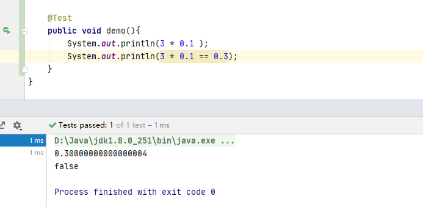
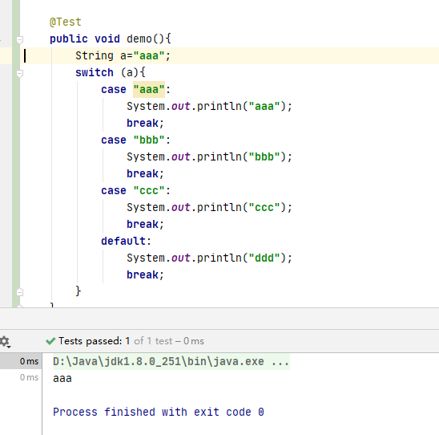

::: tip 前言
* 基础很重要！！！
* 不能只看答案，要亲手验证一下
* 部分著作权归https://pdai.tech所有。
链接：https://pdai.tech/md/interview/x-interview.html
:::

[[toc]]
## 语法基础
### 面向对象特性？
* **封装**

利用抽象数据类型将数据和基于数据的操作封装在一起，使其构成一个不可分割的独立实体。数据被保护在抽象数据类型的内部，尽可能地隐藏内部的细节，只保留一些对外接口使之与外部发生联系。用户无需知道对象内部的细节，但可以通过对象对外提供的接口来访问该对象。  

**优点**：
* 减少耦合：可以独立的开发、测试、优化、使用、理解和修改
* 减轻维护的负担：可以更容易被程序员理解，并且在调试的时候可以不影响其他模块
* 有效地调节性能：可以通过剖析确定那些模块影响了系统的性能
* 提高软件的可重用性
* 降低了构建大型系统的风险：即使整个系统不可用，但是这些独立的模块却有可能是可用的

以下Person类封装name、gender、age等属性，外界只能通过get()方法获取一个Person对象的name属性和gender属性，而无发获取age属性，但是age属性可以攻work()方法使用。
注意到gender属性使用int数据类型进行存储，封装使得用户注意不到这种实现细节。并且在需要修改gender属性使用的数据类型时，也可以在不影响客户端代码的情况下进行。
```java
public class Preson {
  private String name;
  private int gender;
  private int age;

  public String getName() {
    return name;
  }

  public String getGender() {
    return gender == 0 ? "man" : "woman";
  }

  public void work() {
    if( 18 <= age && age <= 50 ){
      System.out.println(name+"is working very hard!");
    }) else {
       System.out.println(name+"can't work any more!");
    }
  }
}
```
* **继承**

继承实现了IS-A关系，例如Cat和Animal就是一种IS-A关系，因此Cat可以继承自Animal，从而获得Animal非private的属性和方法。

继承应该遵循里式替换原则，子类对象必须能够替换掉所有父类对象。

Cat可以当做Animal来使用，也就是说可以使用Animal引用Cat对象。父类引用指向子类对象称为向上转型。
```java
Animal animal = new Cat();
```
* **多态**

多态分为编译时多态和运行时多态:

* **编译时多态主要指方法的重载**
* **运行时多态指程序中定义的对象引用所指向的具体类型在运行期间才确定**

运行时多态有三个条件:

* **继承**
* **覆盖(重写)**
* **向上转型**

下面的代码中，乐器类(Instrument)有两个子类：Wind和Percussion,它们都覆盖了父类的play()方法，并且在main()方法中使用父类Instrument来引用Wind和Percussion对象。在Instrument引用调用play()方法时，会执行实际引用对象所在类的play()方法，而不是Instrument类的方法。
```java
著作权归https://pdai.tech所有。
链接：https://pdai.tech/md/interview/x-interview.html

public class Instrument {
    public void play() {
        System.out.println("Instument is playing...");
    }
}

public class Wind extends Instrument {
    public void play() {
        System.out.println("Wind is playing...");
    }
}

public class Percussion extends Instrument {
    public void play() {
        System.out.println("Percussion is playing...");
    }
}

public class Music {
    public static void main(String[] args) {
        List<Instrument> instruments = new ArrayList<>();
        instruments.add(new Wind());
        instruments.add(new Percussion());
        for(Instrument instrument : instruments) {
            instrument.play();
        }
    }
}
```

### a = a + b 与 a += b 的区别

+=隐式的将加操作的结果类型强制转换为持有结果的类型。如果这两个整型相加，如byte、short或者int，首先会将他们提升到int类型，然后在执行加法操作。
```java
byte a = 127;
byte b = 127;
b = a + b; // error : cannot convert from int to byte
b += a; // ok
```

### 3*0.1 == 0.3 将会返回什么? true 还是 false?

false，因为有些浮点数不能完全精确的表示出来。

::: details 验证

:::

### 能在 Switch 中使用 String 吗?

从 Java 7 开始，我们可以在 switch case 中使用字符串，但这仅仅是一个语法糖。内部实现在 switch 中使用字符串的 hash code。
::: details 验证

:::

### 对equal()和hashCode()的理解?

* **为什么在重写 equals 方法的时候需要重写 hashCode 方法?**

因为有强制的规范指定需要同时重写 hashcode 与 equal 方法，许多容器类，如 HashMap、HashSet 都依赖于 hashcode 与 equals 的规定。

* **有没有可能两个不相等的对象有相同的 hashcode?**

有可能，两个不相等的对象可能会有相同的 hashcode 值，这就是为什么在 hashmap 中会有冲突。相等 hashcode 值的规定只是说如果两个对象相等，必须有相同的hashcode 值，但是没有关于不相等对象的任何规定。

* **两个相同的对象会有不同的 hash code 吗?**

不能，根据 hash code 的规定，这是不可能的。

### final、finalize 和 finally 的不同之处?

* final 是一个修饰符，可以修饰变量、方法和类。如果 final 修饰变量，意味着该变量的值在初始化后不能被改变。
* Java 技术允许使用 finalize() 方法在垃圾收集器将对象从内存中清除出去之前做必要的清理工作。这个方法是由垃圾收集器在确定这个对象没有被引用时对这个对象调用的，但是什么时候调用 finalize 没有保证。
* finally 是一个关键字，与 try 和 catch 一起用于异常的处理。finally 块一定会被执行，无论在 try 块中是否有发生异常。

### String、StringBuffer与StringBuilder的区别？

* 可变和适用范围。String对象是不可变的，而StringBuffer和StringBuilder是可变字符序列。每次对String的操作相当于生成一个新的String对象，而对StringBuffer和StringBuilder的操作是对对象本身的操作，而不会生成新的对象，所以对于频繁改变内容的字符串避免使用String，因为频繁的生成对象将会对系统性能产生影响。 
* 线程安全。String由于有final修饰，是immutable的，安全性是简单而纯粹的。StringBuilder和StringBuffer的区别在于StringBuilder不保证同步，也就是说如果需要线程安全需要使用StringBuffer，不需要同步的StringBuilder效率更高。

### 接口与抽象类的区别？

* 一个子类只能继承一个抽象类，但能实现多个接口
* 抽象类可以有构造方法，接口没有构造方法
* 抽象类可以有普通成员变量，接口没有普通成员变量
* 抽象类和接口都可有静态成员变量，抽象类中静态成员变量访问类型任意，接口只能Public static final（默认）
* 抽象类可以有静态方法；接口在JDK1.8之前不能有静态方法，在JSK1.8中可以有静态方法，且只能被接口类直接调用（不能被实现类的对象调用）
* 抽象类中的方法可以是Public、protected;接口方法在JDK1.8之前只有public abstract，在JDK1.8可以有default方法，在JDK9中允许有private方法

### this() & super()在构造方法中的区别？

* 调用super()必须写在子类构造方法的第一行，否则编译不通过
* super从子类调用父类构造，this在同一类中调用其他构造均需要放在第一行
* 尽管可以用this调用一个构造器，却不能调用两个
* this和super不能出现在同一个构造器中，否则编译不通过
* this()、super()都指的对象，不可以在static环境中使用
* 本质this指向本对象的指针。super是一个关键字

### Java移位运算符

java中有三种移位运算符

* <kbd><<</kbd>:左移运算符，x<<1,相当于x乘以2（不溢出的情况下），低位补0
* <kbd>>></kbd>:带符号右移，x>>1，相当于x除以2，正数高位补0，负数高位补1
* <kbd>>>></kbd>:无符号右移，忽略符号位，空位都以0补齐


